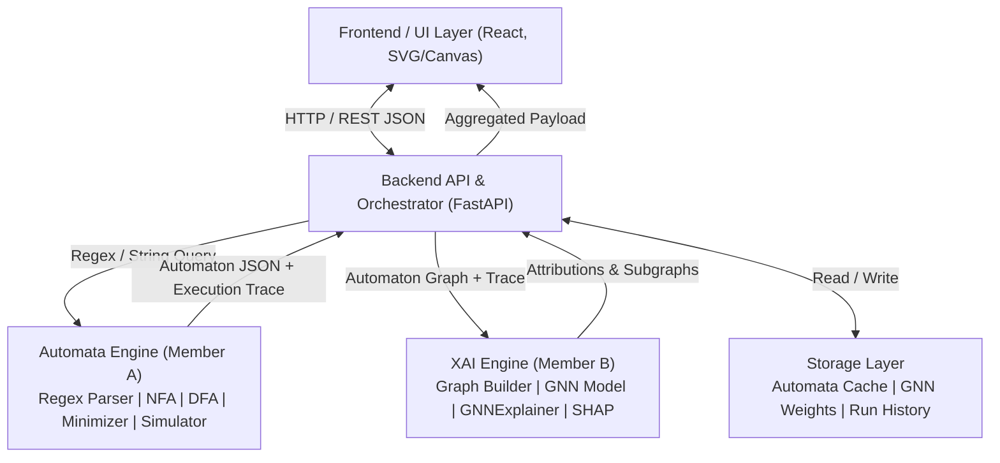
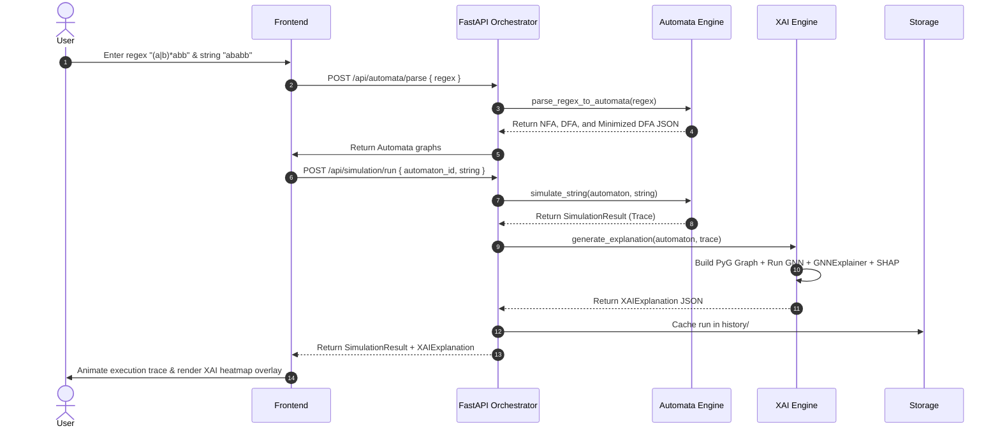

# AutoMind AI — Architecture Specification

This document details the layered architectural design, data pipelines, module interactions, and team role boundaries of the **AutoMind AI** system.

---

## 1. System Overview

AutoMind AI bridges formal language theory with explainable graph artificial intelligence. The platform takes user-supplied regular expressions, constructs equivalent Non-Deterministic Finite Automata (NFA), Deterministic Finite Automata (DFA), and minimized DFAs, validates candidate strings, and employs Graph Neural Networks (GNNs) with XAI methods (GNNExplainer and SHAP) to explain which states and transitions contributed most decisively to language acceptance.

---

## 2. Layered Architecture (6 Layers)

### Layer 1: Frontend / UI Layer (Owned by Member C)
- **Input Interfaces:** Regular expression input box with common presets (`(a|b)*abb`, `(01)*101`, `a*b+`), string test runner, alphabet selector.
- **Automata Visualization:** Interactive graph visualizer (SVG/Canvas) supporting zooming, dragging, dynamic layout, start/accept state halos.
- **Execution Stepper:** Step-by-step playback controls (Play, Pause, Step Next, Step Prev, Reset, Speed Control) highlighting currently active states and traversed transitions.
- **XAI Heatmap & Attribution View:** Visual heatmaps coloring states and edges by their GNNExplainer importance scores, plus SHAP feature bar charts and natural-language rationale summaries.

### Layer 2: Backend API / Orchestrator (Owned by Member C)
- Built with **FastAPI** for high performance and asynchronous execution.
- Routes user requests, handles parameter validation via **Pydantic** models.
- Coordinates the lifecycle: passes regexes to the Automata Engine, routes generated automata and traces into the XAI Engine, and packages the joint payload for client rendering.
- Implements fallback/caching strategies to allow frontend and XAI work prior to Automata Engine completion.

### Layer 3: Automata Theory Engine (Owned by Member A)
- **Regex Parser:** Lexes and parses regular expressions into Abstract Syntax Trees (ASTs) handling concatenation (`.`), alternation (`|`), Kleene star (`*`), and parentheses.
- **NFA Builder:** Implements **Thompson's Construction** to convert AST nodes into an equivalent NFA with epsilon transitions.
- **DFA Converter:** Implements **Subset Construction** (powerset construction) to determinize NFAs into DFAs.
- **DFA Minimizer:** Applies **Hopcroft's Algorithm** or **Myhill-Nerode equivalence partitioning** to collapse indistinguishable states.
- **String Simulator:** Runs input strings step-by-step on the automaton, recording exact traversal paths, active states, and transition steps.
- **Schema Exporter:** Serializes all automata into canonical AutoMind JSON schema.

### Layer 4: XAI Engine (Owned by Member B)
- **Graph Builder:** Ingests Automaton JSON and execution traces, extracting node features ($x_v$: start status, accept status, in-degree, out-degree, traversal frequency) and directed edge features ($e_{uv}$: character index, traversal hit count, traversal order). Converts them into PyTorch Geometric `Data` structures.
- **GNN Model:** Graph Convolutional Network (GCN) or Graph Attention Network (GAT) trained to classify string acceptance over automaton graph topologies and traversal paths.
- **GNNExplainer:** Optimizes edge and node masks to extract the minimal, most influential subgraph explaining the model's prediction.
- **SHAP Explainer:** Computes Shapley feature importance over structural attributes (e.g. final state status, visit frequency, cycle traversal).
- **Explanation Packager:** Formats output scores into normalized floats $[0, 1]$ ready for frontend visualization.

### Layer 5: Storage Layer (Owned by Member C)
- Persists automaton definitions, run histories, and trained GNN weights.
- Provides standard fixture datasets for reproducible testing and offline development.

### Layer 6: Visualization Output Loop
- Closes the feedback loop between model predictions and end-user understanding.
- Overlays XAI importance metrics directly on the original state diagram.

---

## 3. End-to-End Data Flow

---

## 4. Shared JSON Contract

The communication contract between Member A, Member B, and Member C is documented comprehensively in [`docs/json_schema.md`](./json_schema.md). All modules must validate against this contract.
